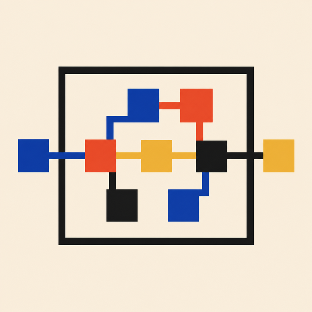
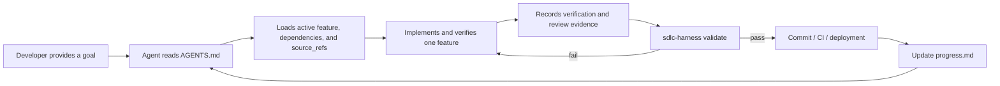
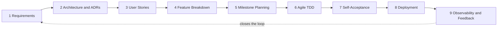

<p align="center">
  
</p>

<h1 align="center">sdlc-harness</h1>

<p align="center">
  <strong><a href="README.md">English</a> | <a href="README.zh-CN.md">中文</a></strong>
</p>

<p align="center">
  <strong>Give coding agents a persistent, verifiable software-development workflow.</strong>
</p>

<p align="center">
  Repository-native governance for the <strong>Software Development Life Cycle (SDLC)</strong>,
  built for coding agents.
</p>

The **Software Development Life Cycle (SDLC)** is the complete process through which software
moves from requirements and architecture to implementation, verification, deployment, and
post-release feedback. `sdlc-harness` turns that process into a repository-native workflow for
coding agents.

Requirements, architecture decisions, feature status, dependencies, verification records, and
progress checkpoints live beside the code instead of disappearing into chat history.

It is agent-independent: any coding agent that can read `AGENTS.md` and repository files can
follow the workflow. Claude Code also receives thin skill wrappers for easier discovery.

## The problem it solves

Coding agents can write code quickly, but work often drifts across sessions:

- the next agent does not know why a change was started;
- half-finished work is reported as complete;
- features lose their links to requirements and architecture decisions;
- several tasks become "in progress" at once;
- progress exists only in a conversation that may no longer be available.

`sdlc-harness` makes the repository the source of truth and gives Git hooks or CI a command
that can reject inconsistent state.

## Quickstart

Requires **Node.js 20 or later**.

### Add it to an existing repository

```bash
cd your-project
npx sdlc-harness adopt
git config core.hooksPath .githooks
npx sdlc-harness validate
npx sdlc-harness status
```

`adopt` writes only missing files. Existing files are left untouched and reported for manual
review.

### Start in an empty repository

```bash
mkdir your-project && cd your-project
npx sdlc-harness init
git config core.hooksPath .githooks
npx sdlc-harness validate
```

Then ask your coding agent to read `AGENTS.md` and help define or decompose the first real
milestone.

## What changes in the agent workflow



The harness provides three layers:

- **Persistent context** — `AGENTS.md`, `feature_list.json`, ADRs, workflow documents, and
  `progress.md` survive agents and sessions.
- **Explicit completion rules** — only one feature may be active, dependencies must be valid,
  and a passing feature must have recorded evidence including a review entry.
- **Executable governance** — `sdlc-harness validate` exits non-zero when repository state
  violates the contract, so the same rules can run locally and in CI.

## See it in action

`status` gives an agent or developer the same machine-readable view of current work:

```bash
npx sdlc-harness status
```

```json
{
  "project": "checkout-service",
  "counts": {
    "not_started": 4,
    "in_progress": 1,
    "blocked": 0,
    "passing": 6
  },
  "activeFeature": {
    "id": "M1-CHECKOUT-003",
    "title": "Handle payment timeout",
    "behavior": "A timed-out payment returns a recoverable error."
  },
  "milestoneCount": 2
}
```

An invalid completion claim is rejected with a concrete reason:

```text
FAILED with 1 error(s):
  - [pass-gate] Feature M1-CHECKOUT-003 is passing but has no evidence entry with kind "review"
```

## What `validate` enforces

The validator checks:

- required fields, valid status values, unique feature IDs, and valid milestone references;
- declared verification for every feature;
- known dependencies with no dependency cycles;
- no dependency on a feature in a later milestone;
- at most one `in_progress` feature;
- evidence and a `review` entry for every `passing` feature;
- monotonic completion: a previously passing feature cannot silently regress;
- coverage of ADR topics required by `harness.config.json`;
- real `source_refs` for non-placeholder features.

Validation records the last successful feature state under `.harness/`, allowing later runs to
detect regressions.

> [!IMPORTANT]
> `validate` verifies repository state and evidence records. It does not execute the verification
> commands declared by a feature or prove that recorded evidence is truthful. Run those commands
> in your development and CI workflows, then record their results.

## The full SDLC workflow

The repository includes guidance for nine connected stages:

1. Requirements
2. Architecture & Technical Design (ADRs)
3. User Story Design
4. Feature Breakdown
5. Milestone Planning
6. Agile Development (TDD)
7. Self-Acceptance Testing
8. Deployment
9. Observability & Feedback Loop



These documents guide the work; the machine-enforced rules currently focus on feature state,
dependencies, evidence records, source references, milestone order, and configured ADR coverage.

## Generated repository contract

After `init` or `adopt`, the repository contains:

```text
AGENTS.md                    # startup, routing, feature, and session rules
feature_list.json            # milestones, features, dependencies, status, and evidence
feature_list.schema.json     # machine-readable feature-list schema
harness.config.json          # project-level governance configuration
progress.md                  # session-by-session checkpoints
docs/
  adr/                       # architecture decision records
  workflow/                  # guides for the nine SDLC stages
.githooks/pre-commit         # runs validation before a commit
.github/workflows/deploy.yml # validates before the generated deployment job
.claude/skills/              # optional Claude Code discovery wrappers
```

The generated pre-commit hook is intentionally inactive until you configure it once:

```bash
git config core.hooksPath .githooks
```

## Commands

| Command                        | What it does                                                            |
| ------------------------------ | ----------------------------------------------------------------------- |
| `sdlc-harness init`          | Scaffold the complete harness in an empty or new repository.            |
| `sdlc-harness adopt`         | Add missing harness files without overwriting existing files.           |
| `sdlc-harness validate`      | Run every structural and governance check; exit non-zero on failure.    |
| `sdlc-harness status`        | Print milestone counts, feature counts, and the active feature as JSON. |
| `sdlc-harness new-feature`   | Interactively append a new feature to`feature_list.json`.             |
| `sdlc-harness new-milestone` | Interactively append a new milestone to`feature_list.json`.           |

## Agent compatibility

| Agent                                     | Core workflow | Extra integration                             |
| ----------------------------------------- | ------------: | --------------------------------------------- |
| Claude Code                               |           Yes | One thin skill wrapper per workflow stage     |
| Codex and other`AGENTS.md`-aware agents |           Yes | Uses the repository contract directly         |
| Other file-aware coding agents            |           Yes | Instruct the agent to read`AGENTS.md` first |

The `.claude/skills/` wrappers contain no separate process logic. The canonical workflow remains
in `AGENTS.md` and `docs/workflow/`, preventing behavior from diverging between agents.

## What it is not

`sdlc-harness` is not a coding agent, test runner, hosted project-management service, or proof
that a product requirement is correct. It is the repository-level protocol and validation layer
that keeps agents, developers, Git hooks, and CI aligned on the same declared state.

## Contributing

Issues and pull requests are welcome. Run the test suite with:

```bash
npm test
```

## License

[MIT](LICENSE)
