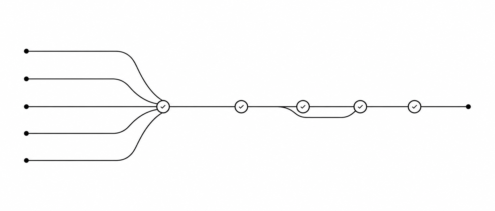
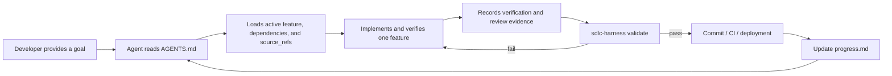
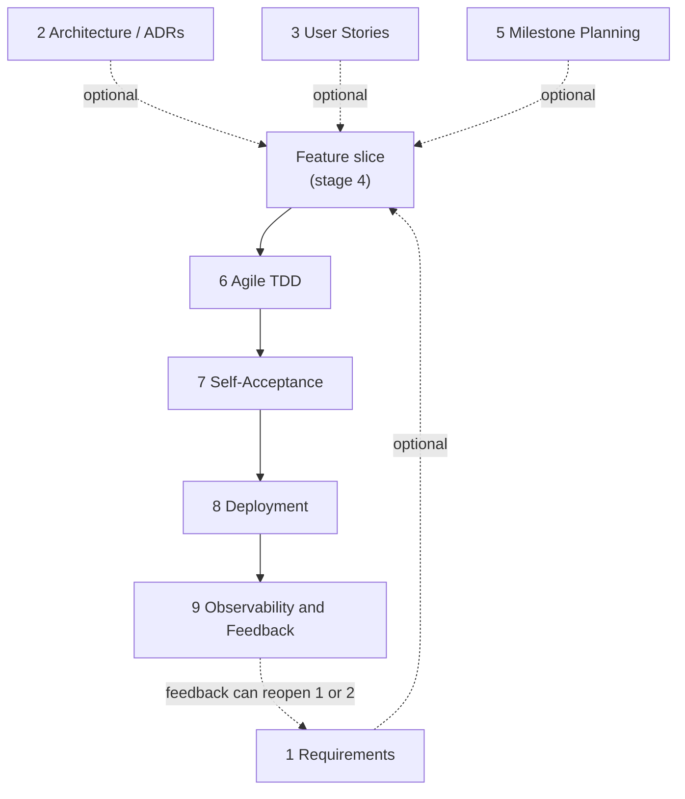

<p align="center">
  <picture>
    <source media="(prefers-color-scheme: dark)" srcset="docs/assets/sdlc-harness-banner-dark.png">
    <source media="(prefers-color-scheme: light)" srcset="docs/assets/sdlc-harness-banner-light.png">
    
  </picture>
</p>

<h1 align="center">SDLC-Harness</h1>

<p align="center">
  <a href="package.json"></a>
  <a href="package.json"></a>
  <a href="LICENSE"></a>
  <a href="https://www.gump.top/sdlc-harness-docs/"></a>
</p>

<p align="center">
  <a href="README.md"></a>
  <a href="README.zh-CN.md"></a>
</p>

<p align="center">
  <strong>Give coding agents a persistent, verifiable software-development workflow.</strong>
</p>

<p align="center">
  Repository-native governance for the <strong>Software Development Life Cycle (SDLC)</strong>,
  built for coding agents.
</p>

<p align="center">
  <a href="#quickstart">Quickstart</a>  · 
  <a href="#the-full-sdlc-workflow">Workflow</a>  · 
  <a href="#commands">Commands</a>  · 
  <a href="https://www.gump.top/sdlc-harness-docs/">Full documentation</a>
</p>

<p align="center"><code>npx @caesarlo/sdlc-harness adopt</code></p>

The **Software Development Life Cycle (SDLC)** is the complete process through which software
moves from requirements and architecture to implementation, verification, deployment, and
post-release feedback. `sdlc-harness` turns that process into a repository-native workflow for
coding agents.

Requirements, architecture decisions, feature status, dependencies, verification records, and
progress checkpoints live beside the code instead of disappearing into chat history.

It is agent-independent: any coding agent that can read `AGENTS.md` and repository files can
follow the workflow. Claude Code also receives thin skill wrappers for easier discovery.

## The problem it solves

Coding agents can write code quickly, but work often drifts across sessions:

- the next agent does not know why a change was started;
- half-finished work is reported as complete;
- features lose their links to requirements and architecture decisions;
- several tasks become "in progress" at once;
- progress exists only in a conversation that may no longer be available.

`sdlc-harness` makes the repository the source of truth and gives Git hooks or CI a command
that can reject inconsistent state.

## Quickstart

Requires **Node.js 22 or later**.

> [!TIP]
> `adopt` creates only missing files. Existing files stay untouched and are listed for manual
> review. If the repo already has its own `AGENTS.md`, adopt never edits it — instead it writes
> the harness's routing/rules content to `AGENTS.sdlc-harness.md` and prints a reminder to add a
> one-line reference from the existing `AGENTS.md`. `validate` keeps failing with an
> `agents-onboarding` error until that reference exists, so this can't be silently forgotten.

### Add it to an existing repository

```bash
cd your-project
npx @caesarlo/sdlc-harness adopt
git config core.hooksPath .githooks
npx @caesarlo/sdlc-harness validate
npx @caesarlo/sdlc-harness status
```

### Start in an empty repository

```bash
mkdir your-project && cd your-project
npx @caesarlo/sdlc-harness init
git config core.hooksPath .githooks
npx @caesarlo/sdlc-harness validate
```

Then ask your coding agent to read `AGENTS.md` and help define or decompose the first real
milestone.

## What changes in the agent workflow



The harness provides three layers:

- **Persistent context** — `AGENTS.md`, `feature_list.json`, ADRs, workflow documents, and
  `progress.md` survive agents and sessions.
- **Explicit completion rules** — each owner may have at most `wip_limit_per_owner`
  active features (default 1), dependencies must be valid, and a passing feature must
  have recorded evidence including a review entry.
- **Executable governance** — `sdlc-harness validate` exits non-zero when repository state
  violates the contract, so the same rules can run locally and in CI.

## See it in action

`status` gives an agent or developer the same machine-readable view of current work:

```bash
npx @caesarlo/sdlc-harness status
```

```json
{
  "project": "checkout-service",
  "counts": {
    "not_started": 4,
    "in_progress": 1,
    "blocked": 0,
    "passing": 6
  },
  "activeFeatures": [
    {
      "id": "M1-CHECKOUT-003",
      "title": "Handle payment timeout",
      "behavior": "A timed-out payment returns a recoverable error.",
      "owner": null
    }
  ],
  "milestoneCount": 2
}
```

An invalid completion claim is rejected with a concrete reason:

```text
FAILED with 1 error(s):
  - [pass-gate] Feature M1-CHECKOUT-003 is passing but has no evidence entry with kind "review"
```

## What `validate` enforces

The validator checks:

- required fields, valid status values, unique feature IDs, and valid milestone references;
- declared verification for every feature;
- known dependencies with no dependency cycles;
- no dependency on a feature in a later milestone;
- at most `rules.wip_limit_per_owner` `in_progress` features per owner (default 1);
- evidence and a `review` entry for every `passing` feature;
- monotonic completion: a previously passing feature cannot silently regress;
- coverage of ADR topics required by `harness.config.json`;
- real `source_refs` for non-placeholder features;
- no requirement/story/acceptance-criterion gaps in the traceability matrix — uncovered
  requirements, orphan stories, orphan features, and unverified acceptance criteria all
  fail `validate` once scope placeholders are decomposed;
- every artifact-level approval (`sdlc-harness evidence approval`) still matches the
  current SHA-256 content hash of the file it approved.

Validation records the last successful feature state under `.harness/`, allowing later runs to
detect regressions — see [Commands](#commands) above for how git history is preferred over this
local cache. `.harness/` is mostly git-tracked on purpose: `events/*.jsonl` (the audit log) and
claim/lease data (embedded directly in each feature, in `feature_list.json`) need to sync across
machines for team use. Only `.harness/last-validated-features.json` — a derived cache, regenerated
by every successful `validate` run — is gitignored; the scaffolded `.gitignore` reflects this.

> [!IMPORTANT]
> `validate` verifies repository state and evidence records; it does not itself execute anything.
> `sdlc-harness verify <feature-id>` is what actually runs a feature's declared verification
> commands and records real, non-fabricatable evidence — see the Commands table above.

## The full SDLC workflow

The repository includes guidance for nine stages, but they are not a mandatory pipeline.
Stages 4, 6, and 7 are the **always-required core loop** for any feature. Stages 1, 2, 3,
and 5 are **conditionally required** — each stage document states at the top when it
applies, and `AGENTS.md`'s Routing Map tells an agent which entry point fits the change
at hand (new capability vs. small fix vs. incident vs. resuming an existing feature).
Stages 8 and 9 are gated by `harness.config.json`'s `deploymentMode`/`observabilityMode`
(each defaults to always-required, so existing repos see no behavior change) — a library,
CLI, or internal script with no deployment target or post-release audience can set either
to `"none"` instead of running through a stage that doesn't apply to it.

1. Requirements *(when scope is unclear)*
2. Architecture & Technical Design (ADRs) *(when the change is load-bearing)*
3. User Story Design *(when a capability benefits from decomposition first)*
4. Feature Breakdown — **always**
5. Milestone Planning *(when new or re-sequenced planning is actually needed)*
6. Agile Development (TDD) — **always**
7. Self-Acceptance Testing — **always**
8. Deployment *(per `deploymentMode`; defaults to always-required)*
9. Observability & Feedback Loop *(per `observabilityMode`; defaults to always-required)*



These documents guide the work; the machine-enforced rules currently focus on feature state,
dependencies, evidence records, source references, milestone order, and configured ADR coverage.

## Generated repository contract

After `init` or `adopt`, the repository contains:

<details>
<summary><strong>Show the generated files and hook setup</strong></summary>

```text
AGENTS.md                    # startup, routing, feature, and session rules
feature_list.json            # milestones, features, dependencies, status, and evidence
feature_list.schema.json     # machine-readable feature-list schema
harness.config.json          # project-level governance configuration
progress.md                  # session-by-session checkpoints
docs/
  adr/                       # architecture decision records
  workflow/                  # guides for the nine SDLC stages
.gitignore                   # ignores only the derived .harness/ snapshot cache and .worktrees/
.githooks/pre-commit         # runs validation before a commit
.github/workflows/ci.yml     # validates (and fails closed until real checks are wired in)
.github/workflows/deploy.yml # validates before the generated deployment job
.claude/skills/              # optional Claude Code discovery wrappers
```

The generated pre-commit hook is intentionally inactive until you configure it once:

```bash
git config core.hooksPath .githooks
```

</details>

## Commands

Run `sdlc-harness --help` (or `-h`) for the full command list, or `sdlc-harness <command> --help` (works with `-h` too, and in any argument position) for a command's own usage — e.g. `sdlc-harness feature --help` or `sdlc-harness milestone archive --help`.

| Command                        | What it does                                                            |
| ------------------------------ | ----------------------------------------------------------------------- |
| `sdlc-harness init`          | Scaffold the complete harness in an empty or new repository.            |
| `sdlc-harness adopt`         | Add missing harness files without overwriting existing files.           |
| `sdlc-harness validate`      | Run every structural and governance check; exit non-zero on failure. The `passing_is_monotonic` check prefers a git baseline (`origin/main`/`main`, or `$HARNESS_BASE_REF`/`$GITHUB_BASE_REF`) over the local `.harness/` snapshot cache, so a regression PR can't sneak past a fresh CI checkout that has no snapshot to compare against. |
| `sdlc-harness status`        | Print feature state, approvals, traceability gaps, and suggested next actions as JSON. |
| `sdlc-harness traceability`  | Print the requirement → story → acceptance criterion → feature → verification matrix as JSON; exit non-zero on uncovered/orphaned links once scope placeholders are decomposed. |
| `sdlc-harness new-feature`   | Interactively append a new feature to `feature_list.json` for manual/debug use. |
| `sdlc-harness new-feature --input <json-file>` | Agent-facing, non-interactive feature creation. The JSON file must be inside the repository and cannot inject claim, evidence, workspace, or a completed status. |
| `sdlc-harness new-milestone` | Interactively append a new milestone to`feature_list.json`.           |
| `sdlc-harness milestone archive <milestone-id> [--actor <id>]` | Move a milestone and all of its features out of `feature_list.json` into `.harness/archive/<milestone-id>.json`, once every feature in it is `passing`. Archived feature ids still satisfy dependencies and count as covered in `traceability` and `validate`'s `passing_is_monotonic` check — archiving only relocates completed work so new milestones start from a lean `feature_list.json`, it never invalidates what already shipped. |
| `sdlc-harness milestone list-archived` | List archived milestones (id, title, feature count, archived-at/by) as JSON. |
| `sdlc-harness feature start <feature-id>` | Atomically claim a ready feature and move it to `in_progress`. |
| `sdlc-harness feature complete <feature-id>` | Atomically require an active claim, passing current-commit verification, dependencies, and a later passing review before moving to `passing`. |
| `sdlc-harness feature block <feature-id> --reason <text>` | Record a blocker, release the claim, and move the feature to `blocked`. |
| `sdlc-harness feature reopen <feature-id>` | Clear a blocker and return a blocked feature to `not_started`. |
| `sdlc-harness verify <feature-id>` | Actually run a feature's declared verification commands and record real pass/fail evidence (with exit code and commit sha) — the only supported way to add "test" evidence. |
| `sdlc-harness evidence manual <feature-id> ...` | Record an attested result for a declared `manual` verification without executing its description as shell code. |
| `sdlc-harness evidence approval <artifact> --actor <id> --summary <text>` | Record human/business approval as project-level evidence bound to the artifact's SHA-256 content hash and current commit. Editing the artifact makes the approval stale and `validate` fails until it is approved again. |
| `sdlc-harness review record <feature-id> ...` | Record structured review evidence bound to the current commit. |
| `sdlc-harness claim <feature-id>` | Atomically claim a feature (sets `owner`, moves `not_started` → `in_progress`), subject to the owner's WIP limit. |
| `sdlc-harness claim --next` | Atomically claim the highest-priority ready feature (not started, dependencies passing, unclaimed). |
| `sdlc-harness claim renew <feature-id>` | Extend a claim's lease before it expires. |
| `sdlc-harness claim <feature-id> --takeover-expired` | Take over a claim whose lease has expired. |
| `sdlc-harness release <feature-id>` | Release a claim (reverts `in_progress` back to `not_started`). |
| `sdlc-harness workspace create <feature-id>` | Create an isolated `git worktree` on branch `feature/<id>` for a claimed feature (`--base <branch>`, default `main`). |
| `sdlc-harness workspace remove <feature-id>` | Remove a workspace. Refuses if it has uncommitted or unpushed work (`--force` to override). |
| `sdlc-harness workspace prune` | Remove workspaces whose claim has been released or expired; skips (reports) any that are dirty. Never touches a workspace under an active claim. |
| `sdlc-harness workspace status` | List all workspaces with their claim/on-disk state, as JSON. |
| `sdlc-harness env` | List the project-level environment commands configured in `harness.config.json`'s `commands` field. |
| `sdlc-harness env check` | Actually run the configured `bootstrap`/`verify`/`e2e`/`health` commands, in that order, stopping at the first failure — proves the project installs, builds, and runs, not just that `feature_list.json` is valid. |
| `sdlc-harness session close` | Read-only end-of-session report: runs `validate`, runs `env check` (if configured), and summarizes git state and `status`'s ready/blocked/next-action view — exits non-zero if `validate` or a configured environment command failed. |
| `sdlc-harness feedback log --source <text> --severity <S1\|S2\|S3\|S4> --observation <text> --disposition <Actioned\|Deferred\|Declined\|Monitoring> [--detail <text>]` | Append a well-formed entry to `docs/product/feedback-log.md` (stage 9) — enforces the shape by construction instead of trusting a hand-written Markdown entry; `validate` also checks any entry that was hand-edited anyway. |

All claim commands accept `--owner <name>` (defaults to `harness.config.json`'s `defaultOwner`), `--actor <id>` (distinguishes multiple Agent sessions run by the same owner — claim uniqueness is always per-feature, never per-actor), and `--ttl <minutes>` (lease length, default 120).

### Cross-machine claiming (git provider)

`sdlc-harness claim <feature-id> --push` commits the claim and pushes it (`--remote`/`--branch`, default `origin`/`main`). Git has no real-time cross-machine lock, so two machines can each claim locally before either has seen the other's push — the actual conflict only surfaces when the second one tries to push. `--push` detects that rejection, discards the losing local commit, resyncs with the remote, and automatically falls back to the next ready feature and pushes that instead, rather than leaving you with a claim that can never reach the remote.

### GitHub provider check

`sdlc-harness provider github check [--owner <o>] [--repo <r>] [--branch <b>]` (owner/repo inferred from the `origin` remote if omitted) checks branch protection, required status checks, force-push blocking, `CODEOWNERS`, and rulesets via `gh api`. Checks that need admin-level access (branch protection detail, rulesets) report `unknown` rather than `fail` when the token can't see them — a normal developer token can still use this without every check erroring out.

`sdlc-harness evidence import <feature-id> --ci-run <run-id> [--owner <o>] [--repo <r>]` imports "test" evidence from a GitHub Actions run — but only after independently confirming via `gh api` that the run actually exists, completed, and succeeded. Nothing about the run is trusted from the caller besides the run id; a run that's still in progress, failed, or doesn't exist is refused, and no evidence is written.

### Solo vs. team mode

`harness.config.json`'s `collaborationMode` controls whether claim/lease is visible:

- **`"solo"`** (the default): use the high-level `feature start` and `feature complete`
  commands; you do not need the lower-level `claim`/`release` commands. An ad-hoc
  `verify` can still auto-claim temporarily, but completion always requires a deliberate
  `feature start` so lifecycle ownership remains observable.
- **`"team"`**: use the same high-level feature commands, or the lower-level claim and
  workspace commands when coordinating concurrent Agents and machines.

### Project environment commands

`sdlc-harness validate` only checks `feature_list.json` and the docs it depends on — it
never executes project code, so passing `validate` proves nothing about whether the
project actually installs, builds, or runs. `harness.config.json`'s `commands` field
closes that gap:

```json
{
  "commands": {
    "bootstrap": "npm install",
    "verify": "npm test && npm run lint",
    "e2e": "npm run test:e2e",
    "health": "curl -f http://localhost:3000/health"
  }
}
```

All four are optional; `sdlc-harness env check` runs whichever are set, in that order,
and stops at the first failure. `start` and `cleanup` are also recognized keys but aren't
run by `env check` — they're situational (start a long-running dev server, tear down
state) rather than pass/fail checks; reference them directly when needed. Leaving
`commands` empty keeps today's behavior — `env check` reports nothing configured rather
than failing.

## Agent compatibility

| Agent                                     | Core workflow | Extra integration                             |
| ----------------------------------------- | ------------: | --------------------------------------------- |
| Claude Code                               |           Yes | One thin skill wrapper per workflow stage     |
| Codex and other`AGENTS.md`-aware agents |           Yes | Uses the repository contract directly         |
| Other file-aware coding agents            |           Yes | Instruct the agent to read`AGENTS.md` first |

The `.claude/skills/` wrappers contain no separate process logic. The canonical workflow remains
in `AGENTS.md` and `docs/workflow/`, preventing behavior from diverging between agents.

## What it is not

`sdlc-harness` is not a coding agent, test runner, hosted project-management service, or proof
that a product requirement is correct. It is the repository-level protocol and validation layer
that keeps agents, developers, Git hooks, and CI aligned on the same declared state.

## Contributing

Issues and pull requests are welcome. Run the test suite with:

```bash
npm test
```

## License

[MIT](LICENSE)
