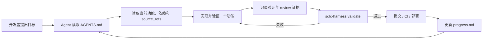
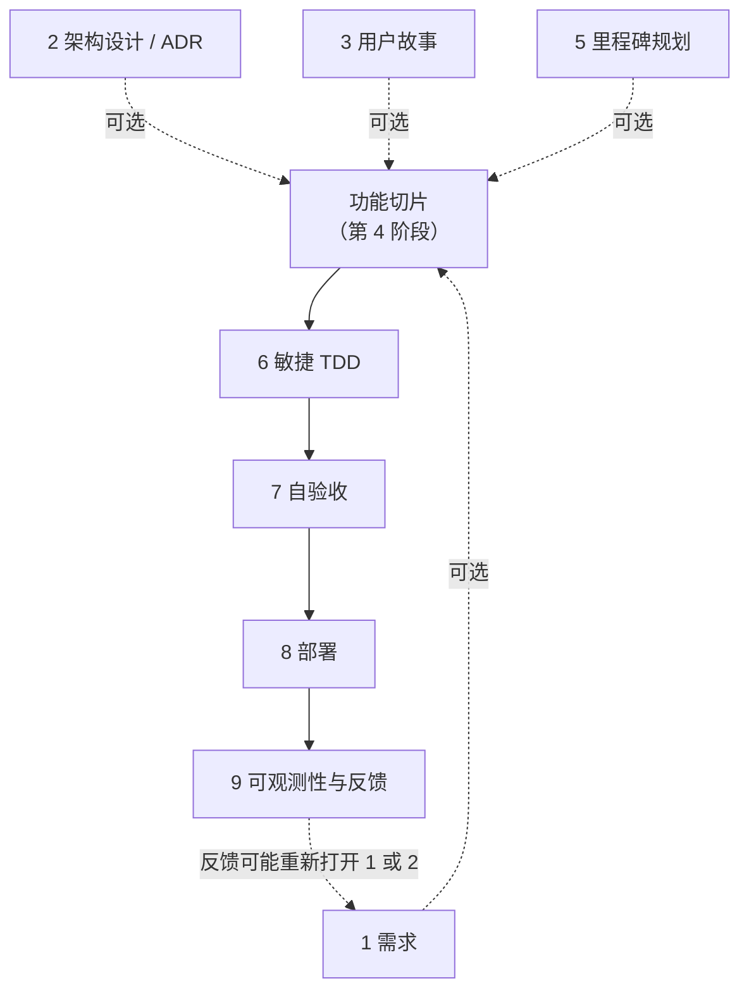

<p align="center">
  <picture>
    <source media="(prefers-color-scheme: dark)" srcset="docs/assets/sdlc-harness-banner-dark.png">
    <source media="(prefers-color-scheme: light)" srcset="docs/assets/sdlc-harness-banner-light.png">
    
  </picture>
</p>

<h1 align="center">SDLC-Harness</h1>

<p align="center">
  <a href="package.json"></a>
  <a href="package.json"></a>
  <a href="LICENSE"></a>
  <a href="https://sdlc-harness.mintlify.site/sdlc-harness-docs"></a>
</p>

<p align="center">
  <a href="README.md"></a>
  <a href="README.zh-CN.md"></a>
</p>

<p align="center">
  <strong>给编码 Agent 一套可持续、可验证的软件开发工作流。</strong>
</p>

<p align="center">
  面向编码 Agent 的仓库原生<strong>软件开发生命周期</strong>（Software Development Life Cycle，SDLC）治理工具。
</p>

<p align="center">
  <a href="#快速开始">快速开始</a>  · 
  <a href="#完整-sdlc-工作流">工作流</a>  · 
  <a href="#命令">命令</a>  · 
  <a href="https://sdlc-harness.mintlify.site/sdlc-harness-docs">完整文档</a>
</p>

<p align="center"><code>npx sdlc-harness adopt</code></p>

**软件开发生命周期**（Software Development Life Cycle，SDLC）是软件从需求与架构设计，经过
实现、验证和部署，再到上线后反馈的完整过程。`sdlc-harness` 将这套过程转化为一套安装在代码
仓库中的编码 Agent 工作协议。

需求、架构决策、功能状态、依赖关系、验证记录和进度检查点都与代码一起保存，不再随着聊天
记录消失。

它不绑定特定 Agent：任何能够读取 `AGENTS.md` 和仓库文件的编码 Agent 都可以遵循这套流程。
Claude Code 还会获得轻量的 skill 包装，方便发现和调用各个阶段。

## 它解决什么问题

编码 Agent 可以快速编写代码，但工作很容易在跨会话时发生漂移：

- 下一个 Agent 不知道一次改动为什么开始；
- 尚未完成的功能被报告为已经完成；
- 功能失去与需求和架构决策的关联；
- 多项任务同时处于“进行中”；
- 进度只存在于之后可能无法访问的对话里。

`sdlc-harness` 让仓库成为唯一状态源，并提供一个能被 Git hook 或 CI 调用的命令，用于拒绝
不一致的状态。

## 快速开始

需要 **Node.js 22 或更高版本**。

> [!TIP]
> `adopt` 只创建缺失文件，不会覆盖已有文件；被跳过的文件会列出来供你手动检查。

### 添加到已有仓库

```bash
cd your-project
npx sdlc-harness adopt
git config core.hooksPath .githooks
npx sdlc-harness validate
npx sdlc-harness status
```

### 在空仓库中开始

```bash
mkdir your-project && cd your-project
npx sdlc-harness init
git config core.hooksPath .githooks
npx sdlc-harness validate
```

然后让你的编码 Agent 先阅读 `AGENTS.md`，协助定义或拆解第一个实际里程碑。

## Agent 的工作方式会发生什么变化



这套 harness 提供三层能力：

- **持久上下文** — `AGENTS.md`、`feature_list.json`、ADR、工作流文档和 `progress.md`
  可以跨 Agent、跨会话保留。
- **明确的完成规则** — 每个 owner 同时最多只能有 `wip_limit_per_owner`（默认 1）个活动功能；
  依赖必须有效；标记为 `passing` 的功能必须记录证据，并包含 review 条目。
- **可执行的治理** — 当仓库状态违反协议时，`sdlc-harness validate` 会以非零状态退出，
  因此同一套规则可以同时用于本地和 CI。

## 实际效果

`status` 为 Agent 和开发者提供同一份机器可读的当前工作视图：

```bash
npx sdlc-harness status
```

```json
{
  "project": "checkout-service",
  "counts": {
    "not_started": 4,
    "in_progress": 1,
    "blocked": 0,
    "passing": 6
  },
  "activeFeatures": [
    {
      "id": "M1-CHECKOUT-003",
      "title": "Handle payment timeout",
      "behavior": "A timed-out payment returns a recoverable error.",
      "owner": null
    }
  ],
  "milestoneCount": 2
}
```

不符合规则的完成声明会被拒绝，并给出具体原因：

```text
FAILED with 1 error(s):
  - [pass-gate] Feature M1-CHECKOUT-003 is passing but has no evidence entry with kind "review"
```

## `validate` 会检查什么

验证器会检查：

- 必需字段、合法状态、唯一功能 ID 和有效的里程碑引用；
- 每个功能都声明了验证方式；
- 依赖指向已知功能，并且不存在依赖环；
- 功能没有依赖更晚里程碑中的功能；
- 每个 owner 同时最多只有 `rules.wip_limit_per_owner`（默认 1）个 `in_progress` 功能；
- 每个 `passing` 功能都有证据和一条 `review` 记录；
- 完成状态单调递增：之前已经通过的功能不能悄悄退回未完成状态；
- ADR 覆盖 `harness.config.json` 要求的主题；
- 非占位功能的 `source_refs` 指向真实文件。

验证成功后，当前功能状态会记录在 `.harness/` 下，供后续验证检测状态倒退——`passing_is_monotonic`
检查优先使用 git 历史（`origin/main`/`main`，或 `$HARNESS_BASE_REF`/`$GITHUB_BASE_REF`）而不是本地
`.harness/` 快照缓存，这样一次全新的 CI checkout（没有历史快照可比对）也不会让回归 PR 蒙混过关。
`.harness/` 目录大部分是刻意纳入 Git 追踪的：`events/*.jsonl`（审计日志）和 claim/lease 数据
（直接嵌在每个功能对象里，位于 `feature_list.json` 中）需要跨机器同步才能支持团队协作。只有
`.harness/last-validated-features.json`——一份由每次成功 `validate` 重新生成的派生缓存——会被
gitignore；脚手架生成的 `.gitignore` 就是这么配置的。

> [!IMPORTANT]
> `validate` 验证的是仓库状态和证据记录，它本身不会执行任何命令。真正运行功能声明的验证命令、
> 并记录真实、不可伪造证据的是 `sdlc-harness verify <feature-id>`——见下方命令表。

## 完整 SDLC 工作流

仓库包含九个阶段指南，但它们不是一条必经流水线。第 4、6、7、8、9 阶段是任何功能都
**必须经过**的核心循环；第 1、2、3、5 阶段是**按需触发**的——每个阶段文档开头都写明了
何时适用，`AGENTS.md` 的 Routing Map 也会告诉 Agent 应该从哪个阶段进入（新能力、小
修复、生产事故，还是继续一个已有功能）。

1. 需求（Requirements）*（范围不明确时）*
2. 架构与技术设计（Architecture & Technical Design，ADR）*（改动影响架构时）*
3. 用户故事设计（User Story Design）*（能力值得先拆解时）*
4. 功能拆解（Feature Breakdown）— **必须**
5. 里程碑规划（Milestone Planning）*（确实需要新规划或重新排序时）*
6. 敏捷开发（Agile Development，TDD）— **必须**
7. 自验收测试（Self-Acceptance Testing）— **必须**
8. 部署（Deployment）— **必须**
9. 可观测性与反馈闭环（Observability & Feedback Loop）— **必须**



这些文档负责指导工作；目前机器强制执行的规则主要集中在功能状态、依赖、证据记录、来源引用、
里程碑顺序和配置要求的 ADR 覆盖范围。

## 生成的仓库协议

运行 `init` 或 `adopt` 后，仓库中会包含：

<details>
<summary><strong>查看生成的文件和 Git hook 配置</strong></summary>

```text
AGENTS.md                    # 启动、路由、功能和会话规则
feature_list.json            # 里程碑、功能、依赖、状态和证据
feature_list.schema.json     # feature list 的机器可读 schema
harness.config.json          # 项目级治理配置
progress.md                  # 按会话保存的检查点
docs/
  adr/                       # 架构决策记录
  workflow/                  # 九个 SDLC 阶段的指南
.gitignore                   # 只忽略派生的 .harness/ 快照缓存和 .worktrees/
.githooks/pre-commit         # 提交前运行验证
.github/workflows/ci.yml     # 运行验证（在真实检查接入之前会主动失败，不会假装通过）
.github/workflows/deploy.yml # 在生成的部署任务前运行验证
.claude/skills/              # 可选的 Claude Code 发现包装
```

生成的 pre-commit hook 默认不会自动启用，需要配置一次：

```bash
git config core.hooksPath .githooks
```

</details>

## 命令

| 命令                           | 作用                                               |
| ------------------------------ | -------------------------------------------------- |
| `sdlc-harness init`          | 在空仓库或新仓库中生成完整 harness。               |
| `sdlc-harness adopt`         | 添加缺失的 harness 文件，不覆盖已有文件。          |
| `sdlc-harness validate`      | 运行全部结构与治理检查；失败时以非零状态退出。     |
| `sdlc-harness status`        | 以 JSON 输出里程碑数量、各状态功能数量和当前功能。 |
| `sdlc-harness new-feature`   | 通过交互问答向`feature_list.json` 添加功能。     |
| `sdlc-harness new-milestone` | 通过交互问答向`feature_list.json` 添加里程碑。   |
| `sdlc-harness verify <feature-id>` | 真正运行一个功能声明的验证命令，并记录真实的通过/失败证据（含退出码和 commit sha）——这是添加“测试类”证据唯一支持的方式。 |
| `sdlc-harness claim <feature-id>` | 原子化地认领一个功能（设置 `owner`，把状态从 `not_started` 推进到 `in_progress`），受 owner 的 WIP 上限约束。 |
| `sdlc-harness claim --next` | 原子化地认领优先级最高的可认领功能（未开始、依赖已通过、未被占用）。 |
| `sdlc-harness claim renew <feature-id>` | 在租约过期前续期。 |
| `sdlc-harness claim <feature-id> --takeover-expired` | 接管一个租约已过期的 claim。 |
| `sdlc-harness release <feature-id>` | 释放一个 claim（把状态从 `in_progress` 还原为 `not_started`）。 |
| `sdlc-harness workspace create <feature-id>` | 为一个已认领的功能创建独立的 `git worktree`，分支名为 `feature/<id>`（`--base <branch>`，默认 `main`）。 |
| `sdlc-harness workspace remove <feature-id>` | 移除一个 workspace。如果存在未提交或未推送的内容会拒绝执行（加 `--force` 强制覆盖）。 |
| `sdlc-harness workspace prune` | 移除 claim 已释放或已过期的 workspace；有未提交/未推送内容的会跳过并报告，而不是被强制删除。永远不会碰仍在有效 claim 下的 workspace。 |
| `sdlc-harness workspace status` | 以 JSON 形式列出所有 workspace 及其 claim/磁盘状态。 |

所有 claim 相关命令都支持 `--owner <name>`（默认取 `harness.config.json` 的 `defaultOwner`）、
`--actor <id>`（用来区分同一个 owner 名下的多个 Agent 会话——claim 的唯一性始终按 feature 判断，
从不按 actor 判断）、以及 `--ttl <minutes>`（租约时长，默认 120 分钟）。

### 跨机器认领（git provider）

`sdlc-harness claim <feature-id> --push` 会提交 claim 并推送（`--remote`/`--branch`，默认
`origin`/`main`）。Git 没有实时的跨机器锁，所以两台机器可能都在各自本地成功认领了同一个
功能——真正的冲突只会在第二次 push 时才暴露出来。`--push` 会检测到这次 push 被拒绝，丢弃
那个没能推送成功的本地 commit，与远程重新同步，然后自动改为认领 ready 队列里的下一个功能
并推送，而不是让你手里攥着一个永远推不上去的 claim。

### GitHub provider 检查

`sdlc-harness provider github check [--owner <o>] [--repo <r>] [--branch <b>]`（如果不传
owner/repo，会尝试从 `origin` 远程推断）通过 `gh api` 检查分支保护、必需状态检查、是否禁止
强制推送、`CODEOWNERS`、以及 ruleset。需要管理员权限才能查看的检查项（分支保护细节、
ruleset）在 token 权限不足时会报告 `unknown` 而不是 `fail`——这样普通开发者 token 也能正常
使用这个命令，不会因为权限问题让所有检查项都报错。

`sdlc-harness evidence import <feature-id> --ci-run <run-id> [--owner <o>] [--repo <r>]`
从一次 GitHub Actions 运行导入“测试类”证据——但前提是通过 `gh api` 独立确认该次运行确实
存在、已经完成、且状态为成功。调用方除了 run id 之外，其余信息一律不被信任；仍在运行中、
已失败、或不存在的 run 会被直接拒绝，且不会写入任何证据。

### Solo 与 Team 模式

`harness.config.json` 的 `collaborationMode` 字段决定 claim/lease 是否对用户可见：

- **`"solo"`**（默认）：你不需要自己运行 `claim`/`release`。`sdlc-harness verify` 会在运行前
  自动为 `defaultOwner` 认领该功能，运行结束后自动释放，整个过程对用户不可见——底层的
  CAS/claim 安全机制依然生效，只是从不暴露出来。如果该功能正被另一个 owner 有效认领着，
  `verify` 仍然会拒绝运行，而不是和对方抢着写 evidence。
- **`"team"`**：`verify` 从不隐式管理 claim。需要先显式认领一个功能（`sdlc-harness claim
  <feature-id>` 或 `claim --next`），再运行 `verify`。

## Agent 兼容性

| Agent                                  | 核心工作流 | 额外集成                               |
| -------------------------------------- | ---------: | -------------------------------------- |
| Claude Code                            |       支持 | 每个工作流阶段都有轻量 skill 包装      |
| Codex 及其他支持`AGENTS.md` 的 Agent |       支持 | 直接使用仓库协议                       |
| 其他能够读取文件的编码 Agent           |       支持 | 需要先明确要求 Agent 阅读`AGENTS.md` |

`.claude/skills/` 中的包装不包含独立流程逻辑。规范流程仍然位于 `AGENTS.md` 和
`docs/workflow/` 中，避免不同 Agent 的行为逐渐分叉。

## 它不是什么

`sdlc-harness` 不是编码 Agent、测试运行器、托管项目管理服务，也不能证明产品需求本身正确。
它是仓库级的协议与验证层，让 Agent、开发者、Git hook 和 CI 基于同一份声明状态协作。

## 贡献

欢迎提交 Issue 和 Pull Request。运行测试套件：

```bash
npm test
```

## 许可证

[MIT](LICENSE)
