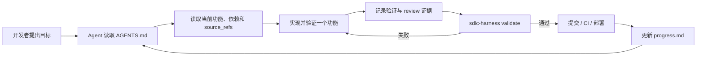
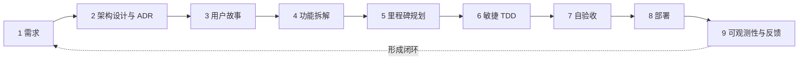

<p align="center">
  <picture>
    <source media="(prefers-color-scheme: dark)" srcset="docs/assets/sdlc-harness-banner-dark.png">
    <source media="(prefers-color-scheme: light)" srcset="docs/assets/sdlc-harness-banner-light.png">
    
  </picture>
</p>

<h1 align="center">sdlc-harness</h1>

<p align="center">
  <a href="package.json"></a>
  <a href="package.json"></a>
  <a href="LICENSE"></a>
</p>

<p align="center">
  <a href="README.md"></a>
  <a href="README.zh-CN.md"></a>
</p>

<p align="center">
  <strong>给编码 Agent 一套可持续、可验证的软件开发工作流。</strong>
</p>

<p align="center">
  面向编码 Agent 的仓库原生<strong>软件开发生命周期</strong>（Software Development Life Cycle，SDLC）治理工具。
</p>

<p align="center">
  <a href="#快速开始">快速开始</a> &nbsp;&middot;&nbsp;
  <a href="#完整-sdlc-工作流">工作流</a> &nbsp;&middot;&nbsp;
  <a href="#命令">命令</a>
</p>

<p align="center"><code>npx sdlc-harness adopt</code></p>

**软件开发生命周期**（Software Development Life Cycle，SDLC）是软件从需求与架构设计，经过
实现、验证和部署，再到上线后反馈的完整过程。`sdlc-harness` 将这套过程转化为一套安装在代码
仓库中的编码 Agent 工作协议。

需求、架构决策、功能状态、依赖关系、验证记录和进度检查点都与代码一起保存，不再随着聊天
记录消失。

它不绑定特定 Agent：任何能够读取 `AGENTS.md` 和仓库文件的编码 Agent 都可以遵循这套流程。
Claude Code 还会获得轻量的 skill 包装，方便发现和调用各个阶段。

## 它解决什么问题

编码 Agent 可以快速编写代码，但工作很容易在跨会话时发生漂移：

- 下一个 Agent 不知道一次改动为什么开始；
- 尚未完成的功能被报告为已经完成；
- 功能失去与需求和架构决策的关联；
- 多项任务同时处于“进行中”；
- 进度只存在于之后可能无法访问的对话里。

`sdlc-harness` 让仓库成为唯一状态源，并提供一个能被 Git hook 或 CI 调用的命令，用于拒绝
不一致的状态。

## 快速开始

需要 **Node.js 20 或更高版本**。

> [!TIP]
> `adopt` 只创建缺失文件，不会覆盖已有文件；被跳过的文件会列出来供你手动检查。

### 添加到已有仓库

```bash
cd your-project
npx sdlc-harness adopt
git config core.hooksPath .githooks
npx sdlc-harness validate
npx sdlc-harness status
```

### 在空仓库中开始

```bash
mkdir your-project && cd your-project
npx sdlc-harness init
git config core.hooksPath .githooks
npx sdlc-harness validate
```

然后让你的编码 Agent 先阅读 `AGENTS.md`，协助定义或拆解第一个实际里程碑。

## Agent 的工作方式会发生什么变化



这套 harness 提供三层能力：

- **持久上下文** — `AGENTS.md`、`feature_list.json`、ADR、工作流文档和 `progress.md`
  可以跨 Agent、跨会话保留。
- **明确的完成规则** — 同时只能有一个活动功能；依赖必须有效；标记为 `passing` 的功能必须
  记录证据，并包含 review 条目。
- **可执行的治理** — 当仓库状态违反协议时，`sdlc-harness validate` 会以非零状态退出，
  因此同一套规则可以同时用于本地和 CI。

## 实际效果

`status` 为 Agent 和开发者提供同一份机器可读的当前工作视图：

```bash
npx sdlc-harness status
```

```json
{
  "project": "checkout-service",
  "counts": {
    "not_started": 4,
    "in_progress": 1,
    "blocked": 0,
    "passing": 6
  },
  "activeFeature": {
    "id": "M1-CHECKOUT-003",
    "title": "Handle payment timeout",
    "behavior": "A timed-out payment returns a recoverable error."
  },
  "milestoneCount": 2
}
```

不符合规则的完成声明会被拒绝，并给出具体原因：

```text
FAILED with 1 error(s):
  - [pass-gate] Feature M1-CHECKOUT-003 is passing but has no evidence entry with kind "review"
```

## `validate` 会检查什么

验证器会检查：

- 必需字段、合法状态、唯一功能 ID 和有效的里程碑引用；
- 每个功能都声明了验证方式；
- 依赖指向已知功能，并且不存在依赖环；
- 功能没有依赖更晚里程碑中的功能；
- 同时最多只有一个 `in_progress` 功能；
- 每个 `passing` 功能都有证据和一条 `review` 记录；
- 完成状态单调递增：之前已经通过的功能不能悄悄退回未完成状态；
- ADR 覆盖 `harness.config.json` 要求的主题；
- 非占位功能的 `source_refs` 指向真实文件。

验证成功后，当前功能状态会记录在 `.harness/` 下，供后续验证检测状态倒退。

> [!IMPORTANT]
> `validate` 验证的是仓库状态和证据记录。它不会执行功能中声明的验证命令，也不能证明记录的
> 证据一定真实。你仍然需要在开发流程和 CI 中运行这些命令，然后记录结果。

## 完整 SDLC 工作流

仓库包含九个相互连接的阶段指南：

1. 需求（Requirements）
2. 架构与技术设计（Architecture & Technical Design，ADR）
3. 用户故事设计（User Story Design）
4. 功能拆解（Feature Breakdown）
5. 里程碑规划（Milestone Planning）
6. 敏捷开发（Agile Development，TDD）
7. 自验收测试（Self-Acceptance Testing）
8. 部署（Deployment）
9. 可观测性与反馈闭环（Observability & Feedback Loop）



这些文档负责指导工作；目前机器强制执行的规则主要集中在功能状态、依赖、证据记录、来源引用、
里程碑顺序和配置要求的 ADR 覆盖范围。

## 生成的仓库协议

运行 `init` 或 `adopt` 后，仓库中会包含：

<details>
<summary><strong>查看生成的文件和 Git hook 配置</strong></summary>


```text
AGENTS.md                    # 启动、路由、功能和会话规则
feature_list.json            # 里程碑、功能、依赖、状态和证据
feature_list.schema.json     # feature list 的机器可读 schema
harness.config.json          # 项目级治理配置
progress.md                  # 按会话保存的检查点
docs/
  adr/                       # 架构决策记录
  workflow/                  # 九个 SDLC 阶段的指南
.githooks/pre-commit         # 提交前运行验证
.github/workflows/deploy.yml # 在生成的部署任务前运行验证
.claude/skills/              # 可选的 Claude Code 发现包装
```

生成的 pre-commit hook 默认不会自动启用，需要配置一次：

```bash
git config core.hooksPath .githooks
```

</details>

## 命令

| 命令 | 作用 |
|---|---|
| `sdlc-harness init` | 在空仓库或新仓库中生成完整 harness。 |
| `sdlc-harness adopt` | 添加缺失的 harness 文件，不覆盖已有文件。 |
| `sdlc-harness validate` | 运行全部结构与治理检查；失败时以非零状态退出。 |
| `sdlc-harness status` | 以 JSON 输出里程碑数量、各状态功能数量和当前功能。 |
| `sdlc-harness new-feature` | 通过交互问答向 `feature_list.json` 添加功能。 |
| `sdlc-harness new-milestone` | 通过交互问答向 `feature_list.json` 添加里程碑。 |

## Agent 兼容性

| Agent | 核心工作流 | 额外集成 |
|---|---:|---|
| Claude Code | 支持 | 每个工作流阶段都有轻量 skill 包装 |
| Codex 及其他支持 `AGENTS.md` 的 Agent | 支持 | 直接使用仓库协议 |
| 其他能够读取文件的编码 Agent | 支持 | 需要先明确要求 Agent 阅读 `AGENTS.md` |

`.claude/skills/` 中的包装不包含独立流程逻辑。规范流程仍然位于 `AGENTS.md` 和
`docs/workflow/` 中，避免不同 Agent 的行为逐渐分叉。

## 它不是什么

`sdlc-harness` 不是编码 Agent、测试运行器、托管项目管理服务，也不能证明产品需求本身正确。
它是仓库级的协议与验证层，让 Agent、开发者、Git hook 和 CI 基于同一份声明状态协作。

## 贡献

欢迎提交 Issue 和 Pull Request。运行测试套件：

```bash
npm test
```

## 许可证

[MIT](LICENSE)
